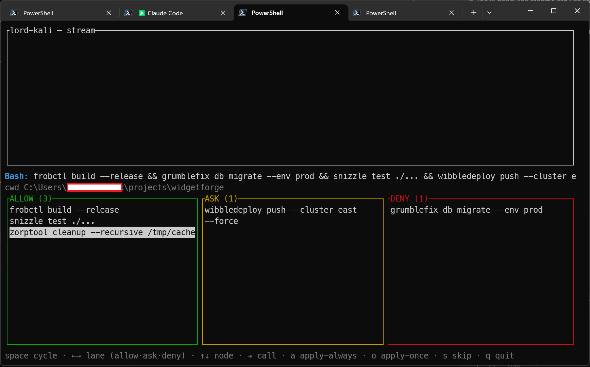

# lord-kali

A Claude Code [PreToolUse hook](https://docs.anthropic.com/en/docs/claude-code/hooks) that filters Bash, PowerShell, WebFetch, and MCP tool calls with a more powerful matching system than Claude Code supports natively, and protects worktrees from accidental parent-directory file operations. It can also route everything it would otherwise leave to Claude Code's per-terminal prompt into one central [approval TUI](#central-approval-tui) shared across all your Claude instances.

Bash commands are parsed with [tree-sitter-bash](https://github.com/tree-sitter/tree-sitter-bash), correctly handling pipelines, `&&`, `||`, `;` chains, subshells, command substitutions (`$(...)`), and `xargs`-wrapped commands. PowerShell commands are parsed with [tree-sitter-powershell](https://github.com/airbus-cert/tree-sitter-powershell), handling pipelines, `;`/newline-separated statements, `&&`/`||` chains, script blocks (`{ ... }`), command substitutions (`$(...)`), the call operator (`& 'C:\path\app.exe'`), and `.exe`/path normalization — and a `pwsh -Command "..."` invocation inside a Bash call is unwrapped and its inner commands matched against the PowerShell rules. WebFetch URLs are matched against configurable glob/regex patterns. Worktree protection automatically denies file reads/writes targeting the parent project when Claude is operating inside a `.claude/worktrees/<name>` directory.

## Install

```sh
curl -fsSL https://raw.githubusercontent.com/insidewhy/lord-kali/main/scripts/install.sh | bash
```

Or clone and build manually:

```sh
make install   # builds and copies to ~/.local/bin/
```

Then point your Claude Code hook at the binary in `~/.claude/settings.json` or `~/.config/claude/settings.json`:

```json
{
  "hooks": {
    "PreToolUse": [
      {
        "matcher": "*",
        "hooks": [
          {
            "type": "command",
            "command": "$HOME/.local/bin/lord-kali"
          }
        ]
      }
    ],
    "PostToolUse": [
      {
        "matcher": "*",
        "hooks": [
          {
            "type": "command",
            "command": "$HOME/.local/bin/lord-kali"
          }
        ]
      }
    ]
  }
}
```

The `PreToolUse` entry is what does the gating. The `PostToolUse` entry is optional and only used for logging — it lets the log capture what actually ran after a call was allowed or approved (see [Logging](#logging)). Omit it if you only want the gate.

## Configuration

### Project-local configuration

You can commit a `.claude/lord-kali.toml` file inside your project repository. This file is discovered by walking up from `cwd` until a `.git` directory is found. `cwd` is the working directory that Claude Code passes in the hook's JSON input, reflecting the project directory Claude Code is operating in (not the process working directory of lord-kali itself). Project-local rules have the highest priority and are evaluated before any global rules.

### Global configuration

All `*.toml` files in `~/.config/lord-kali/` are loaded in lexicographic order and merged. This lets you split config into files like `00-base.toml`, `10-bash.toml`, `20-groups.toml`. If no `.toml` files are found, a default config is used (everything passes through).

Config loading order (highest priority first):

1. `.claude/lord-kali.toml` (project-local, found by walking up from `cwd`)
2. `~/.config/lord-kali/*.toml` (global, in lexicographic order)

Within each file, rules are ordered: top-level rules first, then group rules in definition order. When files are merged, each file's rules are appended after the previous file's. The combined result is evaluated first-match-wins, so rules from earlier files have higher priority. For bash rules sharing the same command key, both files' rules are concatenated (earlier file first). For `[log]`, the last file with a `[log]` section wins.

```toml
# Optional - omit or set enabled=false to disable
[log]
enabled = true
path = "~/.local/state/lord-kali/hook.jsonl"

# Worktree protection is enabled by default.
# Uncomment to disable:
# [worktree-protection]
# enabled = false

### Bash tool filtering

[bash]
# A simple way to configure commands that are allowed with any arguments,
# use `rules` entries with `decision = "allow"` for more complicated
# argument matching
allowed_commands = ["tail", "grep", "ls", "find", "cat", "head", "wc"]

[[bash.rules]]
command = "cargo"
# Arguments can be matched with regexes (wrapped in //) or glob
# patterns. The matcher tests all arguments joined by spaces.
args = "/(fmt|build|test)( .*)?/"
decision = "allow"

[[bash.rules]]
command = "pnpm"
# Empty brace alternative allows matching with or without arguments
args = "{ls,why,info,view}{, **}"
decision = "allow"

[[bash.rules]]
command = "rm"
args = "-rf **"
decision = "deny"
reason = "No recursive force deletes"

[[bash.rules]]
command = "rm"
decision = "ask"
reason = "rm can be dangerous, please ask."

[[bash.rules]]
command = "npm"
decision = "deny"
reason = "Use pnpm instead of npm."

[[bash.rules]]
command = "npx"
decision = "deny"
reason = "Use pnpm dlx instead of npx."

### PowerShell tool filtering

# Same shape as [bash], matched against the PowerShell tool's commands. Cmdlet
# names match as-is (e.g. Get-ChildItem); .exe and full paths are normalized to
# the basename. A `pwsh -Command "..."` run from the Bash tool is unwrapped and
# its inner commands matched against these rules too.
[powershell]
allowed_commands = ["Get-ChildItem", "Get-Content", "Select-String", "Test-Path", "Measure-Object", "Where-Object"]

[[powershell.rules]]
command = "Remove-Item"
# Regex (wrapped in //) over the arguments joined by spaces.
args = '/.*-(Recurse|Force|r)\b.*/'
decision = "deny"
reason = "No recursive/forced Remove-Item."

[[powershell.rules]]
command = "Set-Content"
decision = "ask"
reason = "Writes a file — confirm the target."

[[powershell.rules]]
command = "Invoke-WebRequest"
decision = "ask"
reason = "Network fetch — confirm the URL."

### Web fetch filtering

[[web-fetch.rules]]
url = "https://evil.com/**"
decision = "deny"
reason = "Blocked domain"

# Regex pattern (wrapped in //)
[[web-fetch.rules]]
url = '/.*\.internal\..*/'
decision = "ask"
reason = "Internal URL, please confirm"

# Allow any URL without query parameters that didn't match prior rules
[[web-fetch.rules]]
url = "/[^?]*/"
decision = "allow"
```

### MCP tool filtering

```toml
# Gate MCP tool calls by tool name (mcp__<server>__<tool>). Glob and /regex/ both work.
# A specific ask/deny must precede a broader allow (first match wins).
[[mcp.rules]]
tool = "mcp__playwright__browser_fill_form"
decision = "ask"
reason = "Eyeball form fills"

[[mcp.rules]]
tool = "mcp__playwright__*"
decision = "allow"
```

See [`config.toml`](config.toml) for a more thorough example with many common rules.

### Bash rules

Rules are defined as `[[bash.rules]]` entries. Each rule has:

- **`command`** (required): the command name to match (basename only, e.g. `rm` not `/usr/bin/rm`)
- **`decision`** (required): `allow`, `deny`, or `ask`
- **`args`** (optional): glob or regex pattern matched against the command's arguments (joined by spaces). Omitting matches any arguments. Use `{, **}` to match with or without trailing arguments, e.g. `logs{, **}` matches both `logs` and `logs --tail 100`.
- **`reason`** (optional): message shown to the user. Defaults to `"ok"` for allow rules.

Rules for the same command are evaluated in config file order - the first rule whose `args` pattern matches wins. `allowed_commands` entries are appended after all explicit rules as `allow` matching any arguments.

### PowerShell rules

Rules are defined as `[[powershell.rules]]` entries with the **same fields and semantics as Bash rules** above; they apply to the `PowerShell` tool. The command name is the cmdlet or executable basename (e.g. `Remove-Item`, or `app` for `& 'C:\tools\app.exe'`). The same rules also gate any PowerShell unwrapped from a `pwsh -Command "..."` / `-c` call made through the Bash tool.

### WebFetch rules

Rules are defined as `[[web-fetch.rules]]` entries. Each rule has:

- **`url`** (required): glob or regex pattern matched against the full URL
- **`decision`** (required): `allow`, `deny`, or `ask`
- **`reason`** (optional): message shown to the user. Defaults to `"ok"`.

Rules are evaluated in config file order - the first matching rule wins.

### MCP rules

Rules are defined as `[[mcp.rules]]` entries and apply to any tool whose name starts with `mcp__` (the `mcp__<server>__<tool>` convention). Each rule has:

- **`tool`** (required): glob or regex pattern matched against the full tool name, e.g. `mcp__playwright__*` for a whole server or `mcp__playwright__browser_fill_form` for one tool
- **`decision`** (required): `allow`, `deny`, or `ask`
- **`reason`** (optional): message shown to the user. Defaults to `"ok"`.

Rules are evaluated in config file order — the first matching rule wins. Matching is on the **tool name only**; the tool's structured arguments are never inspected (they are shown read-only in the approval TUI so you can eyeball a call before approving). Because there are no arguments to scope, an allow/deny persisted from the TUI keys on the exact tool name.

### Per-rule project scoping

Any rule (bash, web-fetch, or mcp) can have an optional `projects` array to restrict it to specific directories. A rule with `projects` only applies when the hook's `cwd` is inside one of the listed directories. Rules without `projects` are global (match all cwds). `~` is expanded in project paths.

```toml
[[bash.rules]]
command = "cargo"
args = "publish{, **}"
decision = "deny"
projects = ["~/projects/my-rust-project"]
```

### Groups

Groups set shared `projects` for all rules within them. If a rule inside a group also has `projects`, they merge (union).

```toml
[[group]]
projects = ["~/projects/my-rust-project", "~/projects/other"]

[group.bash]
allowed_commands = ["rustup"]

[[group.bash.rules]]
command = "cargo"
args = "publish{, **}"
decision = "deny"
reason = "Do not publish from these projects"

[[group.bash.rules]]
command = "make"
decision = "allow"
projects = ["~/projects/third"]
# effective projects = group's + ["~/projects/third"]

[[group.web-fetch.rules]]
url = "https://internal.example.com/**"
decision = "allow"
```

Multiple `[[group]]` sections can be defined. Group rules are appended after top-level rules (first-match-wins, definition order). Group `bash`, `powershell`, `web-fetch`, and `mcp` sections use the same format as the top-level sections.

### Worktree protection

When Claude Code uses [worktrees](https://docs.anthropic.com/en/docs/claude-code/worktrees), the working directory is inside `.claude/worktrees/<name>` within the parent project. Claude sometimes attempts to read or write files in the parent project instead of the worktree, which can cause unintended changes to the wrong checkout.

Worktree protection detects when `cwd` matches `<parent>/.claude/worktrees/<name>` and denies file-related tool calls (`Read`, `Write`, `Edit`, `Glob`, `Grep`, `NotebookEdit`, `MultiEdit`) that target the parent project at `<parent>/...` instead of the worktree. The deny reason includes the full corrected worktree path so Claude can retry with the right location.

This is enabled by default. To disable it:

```toml
[worktree-protection]
enabled = false
```

If any config file (project-local or global) sets `enabled = false`, worktree protection is disabled.

### Patterns

- **[Glob via glob-match-ultra](https://github.com/insidewhy/glob-match#syntax)** (default): `*` matches within a segment (stops at `/`), `**` matches across `/` boundaries, `?` matches a single character. Also supports `[a-z]` character classes, `{a,b}` brace expansion with empty alternatives (e.g. `{, **}` to match with or without arguments), and `!` negation.
- **Regex**: wrap the pattern in `//` delimiters, e.g. `/(fmt|build|test)( .*)?/`. `^` and `$` anchors are added automatically - do not include them in the pattern.

## Logging

When `[log]` is enabled, every hook invocation appends one JSON object (one line, JSONL) to the log file. Each record is the raw hook input Claude Code sent, plus lord-kali fields:

- **`ts_ms`**: epoch milliseconds when the record was written
- **`lk_event`**: `pre_tool_use` for gate invocations, `post_tool_use` for after-execution records

To capture `post_tool_use` records you must also register the binary as a `PostToolUse` hook (see [Install](#install)). PostToolUse fires only after a tool actually ran (auto-allowed or user-approved), so it never gates — it only logs, and the tool's `tool_response` is stripped to keep records compact.

Logging is best-effort: if the log file cannot be created or written, the failure is swallowed so it can never block or alter a gate decision.

### Pruning the log

The log is append-only and grows with every tool call. To keep it bounded, drop entries older than a retention window:

```sh
lord-kali prune-logs                 # drop entries older than 3 days (default)
lord-kali prune-logs --days 7        # keep a week instead
lord-kali prune-logs --days 3 /path/to.jsonl  # an explicit log file
```

It rewrites the file atomically, keeping only entries whose `ts_ms` is within the window (lines that can't be dated are kept — pruning never silently discards data it can't read). `lord-kali watch` also runs this automatically on open and once an hour while running (best-effort, 3-day window), so a live watcher self-maintains. For headless retention, schedule the command — e.g. a daily Windows Task Scheduler job:

```powershell
schtasks /create /tn "lord-kali prune" /tr "lord-kali prune-logs" /sc daily /st 03:00
```

### `lk_decision` (pre_tool_use only)

`pre_tool_use` records carry an `lk_decision` object describing how the gate ruled. It is built alongside the decision and never affects it:

- **`final`**: `allow`, `deny`, `ask`, or `passthrough`
- **`kind`**: `command_chain`, `web_fetch`, `mcp`, `worktree_protection`, or `unknown`
- **`reason`**: the message shown to Claude (absent when `final` is `passthrough`)
- **`deciding`**: the node that set the final verdict — the first deny, else the first ask, else the first matched allow — or `null` if nothing matched
- **`nodes`**: every command (or URL) extracted from the call. Each node records its `shell`, `command`, `args`, resolved `decision`, and whether it `matched` a rule. When a rule matched, the node also carries that rule's `reason`, `rule_kind` (`explicit` or `allowed_commands`), `rule_command`, `rule_args`, and `source_file` so you can trace which rule in which config file made the call.

### Watching live

`lord-kali watch --tail` tails the log and prints a colored line per gate decision, so you can see in real time what is being allowed, denied, asked, or passed through to approval:

```sh
lord-kali watch --tail                # uses the [log] path, or the default
lord-kali watch --tail /path/to.jsonl # or an explicit path
```

(Plain `lord-kali watch` opens the interactive [approval TUI](#central-approval-tui) instead; add `--tail` for the non-interactive view described here.)

Each line is also annotated with the command nodes that matched **no rule**, shown as `(no rule: <cmd>, …)`. These are your gap candidates for the allow/deny lists — the commands lord-kali currently has no opinion on. An `allow` verdict never shows this (every node matched by definition); a `passthrough` shows the unknown node(s), and a chain like `pwd && gh ...` flags only `gh` while the already-allowed `pwd` stays quiet. Running real commands and watching what gets flagged is a quick way to discover what to add to your config.

It also correlates each `pre_tool_use` with its `post_tool_use`:

- A `passthrough` or `ask` that is followed by execution prints `approved & ran` — a high-confidence record that the call *ran*. Note this covers both "you approved it at a prompt" and "Claude Code's own `permissions.allow` rules auto-allowed it"; the log cannot tell the two apart, so a future auto-tuner should cross-reference Claude Code's allow-list before treating one of these as a manual approval worth promoting.
- A `passthrough` or `ask` with no execution within 60s prints `no execution — rejected or abandoned?`. This is the one negative signal available: a rejection writes nothing to the log, so its only trace is the *absence* of a matching `post_tool_use`, and that absence is noisy (it also covers abandoned or still-pending calls). Treat it as a weak hint, not a fact. For an `ask`, the line also names the rule node that triggered the prompt (`ask triggered by: <node> — <reason>`).

`allow` calls always run, so their `post_tool_use` is not restated. Color is disabled automatically when stdout is not a terminal or when `NO_COLOR` is set.

## Central approval TUI

By default, an `ask` rule or a pass-through (no rule matched) defers to Claude Code's own permission prompt, which appears in whichever terminal that Claude instance owns. With several Claude instances running, there is no single place to triage approvals.

The **approval TUI** gives you one. When you opt in and run `lord-kali watch`, every `ask`/pass-through call from every Claude instance is routed to that one TUI instead of prompting per-terminal. It is designed for intensive "new territory" sessions — e.g. bringing up a new toolchain — where you want to whitelist a burst of unfamiliar commands quickly while you work.



```toml
# in any ~/.config/lord-kali/*.toml — opt in (default off)
[approval]
enabled = true
# live_rules = "99-live.toml"            # file the TUI appends allow/deny-always rules to
# state_dir  = "~/.local/state/lord-kali" # queue + heartbeat live here
# guardrail_commands = ["terraform", "kubectl"]  # extra commands that default to tight scope
```

```sh
lord-kali watch   # opens the TUI; keep it running while you work
```

You don't have to babysit the window: while approvals are pending the terminal **title** shows `● lord-kali — N waiting`, the tab/taskbar icon turns amber (on Windows Terminal, via `OSC 9;4`), and a bell rings when a new one arrives — so a backgrounded watch tab tells you when it needs you. All three clear once the queue is empty, and reset on quit. (Terminals that don't support a given sequence simply ignore it.)

The TUI has three regions: a scrolling decision **stream** on top, the **approval zone** in the middle, and a help line locked to the bottom row. Each pending call expands to its **actionable command nodes** — the ones that matched no rule or matched an `ask` rule (a chain like `pwd && gh ... | jq ...` lists only `gh` and `jq`). The approval zone is three lanes — **ALLOW · ASK · DENY**; every node starts in ALLOW, and you sort each into a lane before committing:

| key | action |
| --- | --- |
| `←` / `→` | step the focused node one lane toward ALLOW / DENY (ASK is the middle) |
| `space` | cycle the focused node ALLOW → ASK → DENY |
| `↑` / `↓` | move between nodes |
| `t` | toggle the focused node's persisted scope: **tight** (full args, path-specific) ⇄ **subcommand** |
| `⇥` (Tab) | switch between pending calls |
| `a` | **apply-always** — resolve the call by lane and persist a rule for each allowed/denied node |
| `o` | **apply-once** — same, but for this call only (nothing persisted) |
| `s` | **skip** — pass the whole call through to Claude Code's prompt, untouched (nothing persisted) |
| `q` | quit the TUI |

One commit resolves the whole call from the lanes: any node in **DENY** denies the call; a node in **ASK** defers the call to Claude Code's own prompt (a passthrough); only if every node is in **ALLOW** does the call run outright. So you can allow the parts you trust, deny the dangerous ones, and hand the uncertain ones back to the agent — in a single keystroke. `s` is the quick "I'm not deciding this here" for an entire call.

**apply-always** appends an ordinary rule to `~/.config/lord-kali/99-live.toml` for each node (sorted last, so it never shadows your explicit rules). By default the scope is **subcommand** (the node's first argument): allowing `git push` writes `command = "git", args = "push{, **}"`, so it does **not** also bless `git commit`. Web-fetch nodes persist the exact URL; MCP nodes persist the exact tool name (no args, no `t` toggle). Future matching calls then resolve instantly without reaching the queue — the gap closes as you go.

**Guardrail commands and tight scope.** Subcommand scope is wrong for destructive, path-operating commands: a one-off `rm -rf ./test-results` would otherwise persist as a blanket `rm -rf` allow (the first argument is the flag `-rf`, not a subcommand). So a built-in set of destructive commands — `rm`, `rmdir`, `dd`, `mkfs`, `shred`, `truncate`, `del`, `rd`, `Remove-Item`, `Clear-Content` (extend it via `guardrail_commands`) — defaults to **tight** scope instead: the full args are pinned, so `rm -rf ./test-results` persists `args = "-rf ./test-results{, **}"` and can never match `rm -rf /`. Press **`t`** to toggle any node between tight and subcommand scope; the header shows the exact rule that will be written before you commit.

### Graceful degradation

The TUI is strictly opt-in and never a single point of failure:

- With `[approval]` disabled (the default), behavior is exactly as before — this feature is inert.
- With it enabled but **no TUI running**, the hook detects the stale heartbeat and immediately falls back to today's behavior (existing rules still apply; `ask`/pass-through go to Claude Code's prompt). Closing the TUI mid-session reverts to defaults within a couple of seconds.
- A blocked call self-times-out below Claude Code's hook timeout and falls back, so a slow or absent operator never stalls an agent.

## Decision priority

### Bash

Given the set of commands extracted from a bash string, each command is resolved against its rules (first args match wins). Then across all commands:

1. **deny** - if ANY command resolves to deny
2. **ask** - if ANY command resolves to ask
3. **allow** - if ALL commands resolve to allow
4. **pass-through** - otherwise (no output, defers to Claude Code defaults)

### WebFetch

Given a URL, rules are evaluated in config file order:

1. **First matching rule** - its decision (allow/deny/ask) is returned
2. **pass-through** - if no rule matches (no output, defers to Claude Code defaults)

### MCP

Given a tool whose name starts with `mcp__`, `[[mcp.rules]]` are evaluated in config file order against the tool name:

1. **First matching rule** - its decision (allow/deny/ask) is returned
2. **pass-through** - if no rule matches (no output, defers to Claude Code defaults)

## Parsing

Commands are extracted by walking the full tree-sitter-bash AST. This covers:

- Pipelines: `ls | grep foo` extracts `ls`, `grep`
- Chains: `ls && rm foo` extracts `ls`, `rm`
- Subshells: `(rm foo)` extracts `rm`
- Command substitutions: `echo $(rm foo)` extracts `echo`, `rm`
- `xargs` sub-commands: `find . | xargs -I {} rm {}` extracts `find`, `xargs`, `rm`
- Path normalization: `/usr/bin/rm` matches a rule for `rm`

## Tests

```sh
cargo test
```
